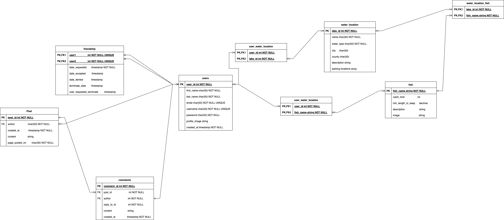

# Texas Anglers App

### Project Proposal

## Overview

An app that will have information about fishing locations accross the United States. The app will use embedded Google maps for each location. [Weather API](https://www.weatherapi.com/) will be used to show what the weather will be like at the location. Users will be able to create accounts, add information about fishing locations and share what there experience was at the specific loation.

## Goals

1. Allow users to be able create account to view infomation about fishing locations in their area or where they are traveling to, such as current weather.
2. Users can post the type of fish they caught and other information about that fishing trip.

## Demographic

Users of this site will be people that like to fish as a hobby and share their experience with others.

## Data

The data that will be used for this application is from the users and different parks and wildlife websites.

## Approach

### Schema (Tentative)

### Potential Problems

1. Trouble with scraping and cleaning up data from sites on fishing.

### Sensitive Information

1. User passwords and login information.

### Functionality

- Users will be able to look up infomation on fishing locations. They will be able to view weather in that location. They will be able to add infomation about their catches, places to park, places to eat or get equipment near the location.

### User Flow

- Users can see basic information about fishing locations without having an account
- If user has an account:
  - the can add information about their exprience at the location.
  - They will also be able to view what others post, what fish are biting on and more.

### Future Additions

- Use web scraper to get infomation about fishing, best locations, fishing guides and more.
- Users can add information to the map and chart data about specific bodies of water added to the individual bodies of water.
- Add charts/graphs to show the type of fish caught, bait used, time of day, and weather condition trends.
