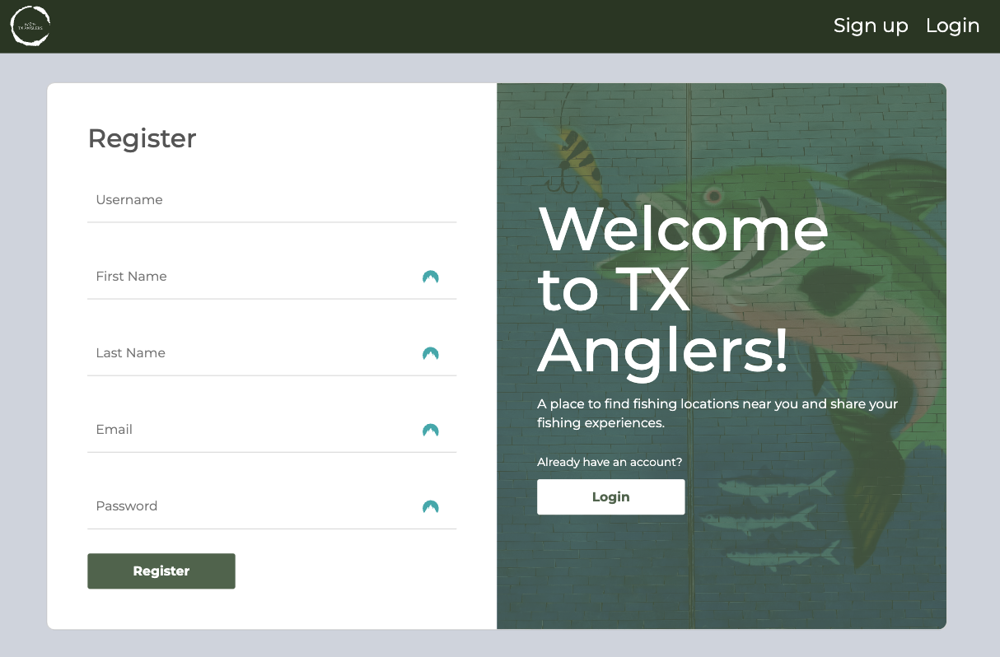

# Texas Anglers App

<!-- Description of what the app does brief user flow -->

<!-- ## Deployed Site:
View the deployed app [here](https://coding-quiz-app-rb.herokuapp.com/signup). -->

## APIs Used

- [Map API](https://www.openstreetmap.org/)
  - Use map to show body of water and add pins to locations to park, restrooms, places to eat
- [Weather API](https://www.weatherapi.com/)
  - Use to show weather at body of water selected for next 3 days

## Data

- Created web scraper to get data about lakes and rivers in Texas
- Data will also come from users about fish caught and locations around body of water that may be important to other anglers

## Technology Stack

- JavaScript
- React
- Node.js
- Express.js
- CSS/HTML
- PostgreSQL
- Bootstrap
- Axios

## User Flow

<!--
- When the user first goes to the home page they will see the signup page.
  
- If the user already has an account they can click the link at the bottom of the page to go to the login screen
  
- Once the user is logged in they will be taken to their user dashboard.
  
- Here the user can click the Take Quiz button to go to the page to create their quiz.
  
- Once they have selected the category, number of questions and difficulty they will click start quiz and be taken to the quiz.
  
- Once they have submitted the quiz they will be taken to the results page.
  
- The user can also edit their information by clicking the Edit Profile in the top right corner. -->
