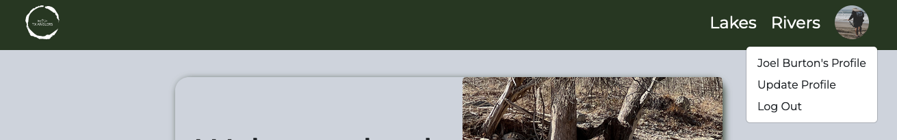
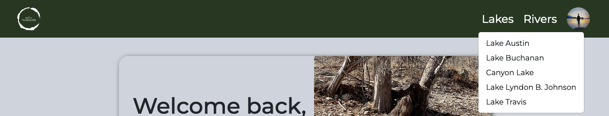

# Texas Anglers App

<!-- Description of what the app does brief user flow -->

<!-- ## Deployed Site:
View the deployed app [here](https://coding-quiz-app-rb.herokuapp.com/signup). -->

## APIs Used

- [Weather API](https://www.weatherapi.com/)
  - Use to show weather at body of water selected for next 3 days

## Data

- Lake and river information collected into a js file.
- Data will also come from users about fish caught and locations around body of water that may be important to other anglers

## Technology Stack

- JavaScript
- React
- Node.js
- Express.js
- CSS/HTML
- PostgreSQL
- Bootstrap
- Axios

## User Flow

- When the user first goes to the home page they will see a welcome page
  
- If user clicks the Sign up button they will see the sign up page.
  
  - Once the user has signed up they will be taken to the homepage.
    
- If the user already has an account they can click the login link to go to the login screen
  
- Once the user is logged in they will be taken to the homepage.
  
- User can click on profile image or name (if they do not have a profile picture).
  
- User clicks profile in dropdown it will take them to their profile page.
  - Current User:
    
  - New User:
    
- User clicks on Update Profile it will take them to the update user form where they can add a profile image and cover photo or change any of their user information.
  
- Users click Log Out in menu they will be logged out of the app and taken back to the original home screen.
- User can click on Lakes or Rivers to get a dropdown menu with a list for each fishing location on the app.

  - Lake Menu:
    
  - River Menu:
    

- Users can then select the lake or river of their choice to go to the locations page.
  - Example Lake Page:
    
  - Example River Page:
    
- The user can also edit their information by clicking the Edit Profile in the top right corner.

## Future Features

- Create web scraper to get data about lakes and rivers in Texas.
- Users will be able to log fish they have caught at a given location
  - Use fish caught data to create visual representations of data.
